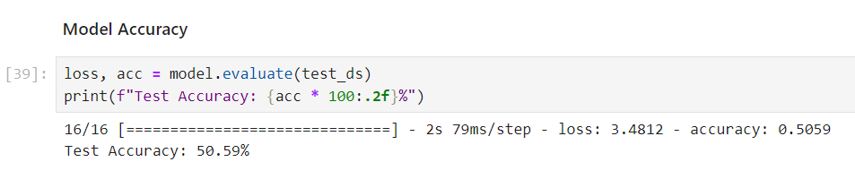

# 🐱 Cat Breed Classification — CNN vs. Feature Engineering

| Approach | Method | Test Accuracy |
|---|---|---|
| Deep Learning | CNN + Augmentation + Regularization | **75.98%** |
| Feature Engineering | YOLO Segmentation + LightGBM | **81.81%** |

A dual-approach computer vision project classifying **10 cat breeds** from ~5,000 images — comparing a custom-built CNN against a classical feature engineering pipeline powered by YOLO segmentation and ensemble classifiers.

---

## 🎯 What This Project Does

> *"When data is limited, does classical feature engineering still outperform deep learning — and by how much?"*

Answers this by building both pipelines in full, measuring them on the same dataset, and analyzing exactly where each approach wins or loses.

---

## 🔬 Approach 1 — Deep Learning (CNN)

**Architecture**
- Sequential CNN: 2× Conv2D + MaxPooling → Flatten → Dense(128) → Dense(64) → Softmax(10)
- 12.8M trainable parameters
- Adam optimizer · Sparse Categorical Crossentropy

**Overfitting Problem & Fix**
- Initial model: ~55% validation accuracy — clear overfitting
- Applied **Data Augmentation**, **Dropout regularization**, and **L2 regularization**
- Improved model: **75.98% test accuracy** after 500 epochs

| | Model 1 (Baseline) | Model 2 (Improved) |
|---|---|---|
| Test Accuracy | 50.59% | **75.98%** |
| Epochs | 20 | 500 |
| Regularization | None | Dropout + L2 + Augmentation |

*Baseline — clear overfitting, validation frozen at ~55%*

*Improved — validation accuracy steadily rising to ~75%*

*Sample predictions — 11/12 correct on unseen images*

---

## 🔬 Approach 2 — Feature Engineering Pipeline

**Step 1 — Image Segmentation (YOLOv8)**
- Used `yolov8x-seg.pt` to detect and isolate cats from backgrounds
- Generated binary masks → extracted cat-only images on black background

**Step 2 — Feature Extraction (8 descriptors)**

| Type | Descriptor | What It Captures |
|---|---|---|
| Global | Color Histogram | Color distribution |
| Global | Hu Moments | Global shape |
| Global | Haralick / LBP | Texture patterns |
| Local | BRISK | Keypoint features |
| Local | HOG | Intensity gradients |
| Local | GLCM | Pixel spatial relationships |
| Local | Gabor Filters | Frequency & orientation |
| Local | Contour Features | Shape boundaries |

**Step 3 — Feature Reduction**
- Original: 1,309 features → Reduced to **200 features** via Random Forest importance
- Marginal accuracy difference, ~6× fewer features

**Step 4 — Classifier Benchmark (8 models)**

| Classifier | Accuracy | AUC | Time |
|---|---|---|---|
| **LightGBM** | **81.81%** | 0.9818 | 92s |
| XGBoost | 80.84% | 0.9778 | 276s |
| Logistic Regression | 79.33% | 0.9660 | 8.8s |
| SVM | 78.58% | 0.9723 | 15s |
| Random Forest | 71.91% | 0.9586 | 109s |

  

---

## 💡 Key Finding

> **Feature Engineering (81.81%) outperforms CNN (75.98%) by ~6% on this dataset.**
>
> With only 500 images per class, the CNN struggles to generalize. Isolating the subject via YOLO segmentation before extraction gives the classical pipeline a significant edge — background noise is eliminated before features are even computed. However, CNNs would likely dominate with 10× more data.

---

## 🛠️ Tech Stack

`Python` · `TensorFlow / Keras` · `YOLOv8 (Ultralytics)` · `OpenCV` · `scikit-learn` · `LightGBM` · `XGBoost` · `scikit-image` · `Matplotlib`

---

## 📁 Project Structure

| File | Description |
|---|---|
| `Deep_Learning.ipynb` | CNN pipeline — build, train, improve, evaluate |
| `Feature_Engineering.ipynb` | Feature extraction, classifier benchmark |
| `segmentation.ipynb` | YOLOv8 segmentation — cat isolation |

> Dataset: [Kaggle — Pop Cats (20 breeds × 500 images)](https://www.kaggle.com/datasets/knucharat/pop-cats)

---

## 📊 Scale

| Metric | Value |
|---|---|
| Dataset | 5,000 images · 10 breeds · 500/class |
| Train / Val / Test | 3,593 / 898 / 508 |
| CNN parameters | 12,859,178 |
| Feature vector (original) | 1,309 dimensions |
| Feature vector (reduced) | 200 dimensions |
| Classifiers benchmarked | 8 |
